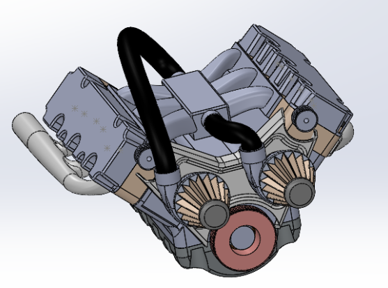

## Solidworks Fully Functional V6 Engine

"Modeled fully assembled V6 engine in SolidWorks using 30+ individual parts and subassemblies.
Completed over several weeks guided by 4+ hours of technical instructional content." 

# Posts

